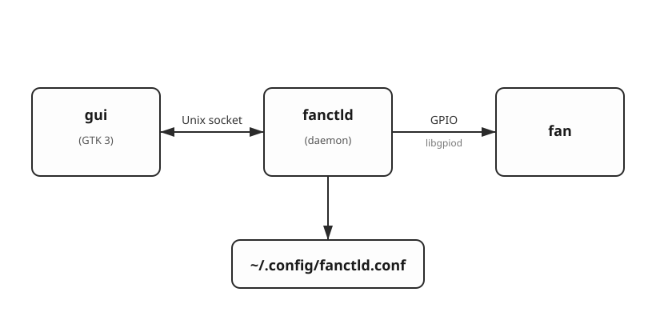
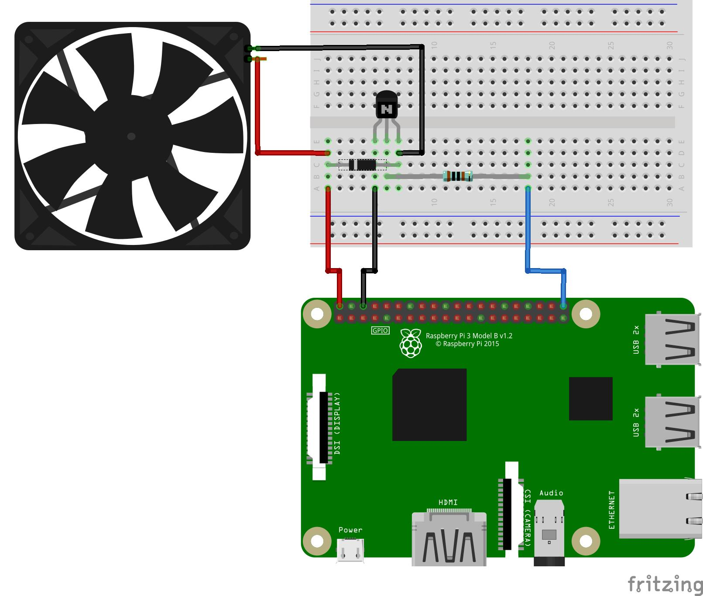
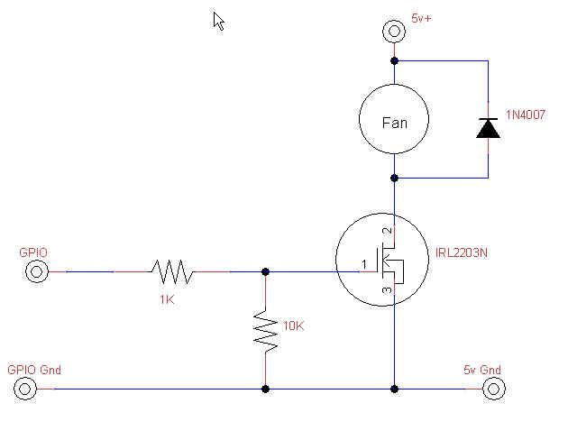

# Raspberry Pi Fan Controller

Fan controller for Raspberry Pi 3.

Power is supplied to the fan only once the CPU temperature exceeds a threshold set via the GUI. The temperature is read through sysfs.

The software is made up of two processes:

- **`fanctld`** — a background daemon that reads the CPU temperature and switches a 2-pin fan on/off via GPIO.
- **`gui`** — a GTK 3 GUI that displays live state and lets the user change the temperature threshold and the GPIO pin.

Inter-process communication is over Unix sockets.

> [Русская версия](README.ru.md)

---

## GUI


## Architecture



- The **daemon** polls the CPU temperature about once a second and toggles the fan with hysteresis: turns on at `temp ≥ threshold`, turns off at `temp ≤ threshold − 5 °C`.
- The **GUI** opens a fresh connection to `/tmp/fan-controller.sock` every second to read the current state, and sends `SET` commands when the user changes settings in the dialog.
- Settings are persisted in `~/.config/fanctld.conf`.

## Hardware






### Parts list

| Part                                 | Purpose                                                              |
|--------------------------------------|----------------------------------------------------------------------|
| 2-pin 5 V fan                        | the cooling itself                                                   |
| `IRL2203N` (or `IRLZ44N` / `2N7000`) | logic-level N-channel MOSFET — the actual switch                     |
| 1 kΩ resistor                        | gate series resistor (protects the GPIO)                             |
| 10 kΩ resistor                       | gate pull-down — keeps the fan off while the Pi boots                |
| `1N4007` diode                       | flyback diode across the fan, protects the MOSFET                    |

## Building the software

### Prerequisites

#### Build tools

| Package      | Debian / Pi OS               | Fedora                     |
|--------------|------------------------------|----------------------------|
| GCC          | `build-essential`            | `gcc`                      |
| GNU make     | (in `build-essential`)       | `make`                     |
| `pkg-config` | `pkg-config`                 | `pkgconf-pkg-config`       |

#### GTK 3

| Package | Debian / Pi OS  | Fedora        |
|---------|-----------------|---------------|
| GTK 3   | `libgtk-3-dev`  | `gtk3-devel`  |
| Pango   | (part of GTK)   | (part of GTK) |

#### libgpiod

| Package                            | Debian / Pi OS   | Fedora            |
|------------------------------------|------------------|-------------------|
| Headers                            | `libgpiod-dev`   | `libgpiod-devel`  |
| `gpiodetect` / `gpioset` utilities | `gpiod`          | `libgpiod-utils`  |


## Running

### On Raspberry Pi 3

```sh
sudo apt install libgpiod-dev libgtk-3-dev
make pi
make ui
./fanctld &
./gui
```

### On Linux x86 for development

```sh
make
make ui
./fanctld &
./gui
```

## About UNIX sockets

```
GET state      →  temp=N threshold=N pin=N fan=on|off
SET temp N     →  OK | ERR <reason>
SET pin  N     →  OK | ERR <reason>
```

## Configuration file

`~/.config/fanctld.conf`, atomically rewritten on every successful `SET`:

```
temperature=40
pin=4
```

The file can be edited by hand. The daemon validates ranges on load.
