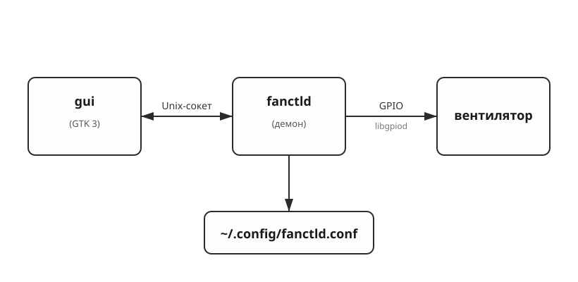

# Контроллер вентилятора Raspberry Pi

Контроллер вентилятора для Raspberry Pi 3

Питание на вентилятор подается только после превышения заданного через GUI порога температуры. Температура считывается через sysfs. 

Программная часть состоит из двух процессов:

- **`fanctld`** — фоновый демон, который читает температуру процессора и включает/выключает 2-контактный вентилятор через GPIO.
- **`gui`** — GUI на GTK 3, отображающий состояние в реальном времени и позволяющий менять температурный порог и номер GPIO-пина.

Межпроцессное взаимодействие реализовано через Unix-сокеты.

> [English version](README.md)

---

## GUI


## Архитектура



- **Демон** опрашивает температуру процессора примерно раз в секунду и переключает вентилятор с гистерезисом: включает при `temp ≥ порог`, выключает при `temp ≤ порог − 5 °C`.
- **GUI** раз в секунду открывает новое подключение к `/tmp/fan-controller.sock`, чтобы получить текущее состояние, и отправляет команды `SET`, когда пользователь меняет настройки в диалоге.
- Настройки сохраняются в файле `~/.config/fanctld.conf`.

## Железо


### Перечень компонентов

| Компонент                            | Назначение                                                          |
|--------------------------------------|---------------------------------------------------------------------|
| 2-контактный вентилятор на 5 В       | собственно охлаждение                                               |
| `IRL2203N` (или `IRLZ44N` / `2N7000`)| logic-level N-канальный MOSFET — сам коммутирующий ключ             |
| Резистор 1 кОм                       | последовательный резистор затвора (защищает GPIO)                   |
| Резистор 10 кОм                      | подтяжка затвора к земле — держит вентилятор выключенным при загрузке |
| Диод `1N4007`                        | обратный (flyback) диод параллельно вентилятору, защищает MOSFET    |

## Сборка программных компонентов

### Зависимости

#### Инструменты сборки 

| Пакет        | Debian / Pi OS         | Fedora                     |
|--------------|------------------------|----------------------------|
| GCC          | `build-essential`      | `gcc`                      |
| GNU make     | (входит в `build-essential`) | `make`               |
| `pkg-config` | `pkg-config`           | `pkgconf-pkg-config`       |

#### GTK 3 

| Пакет                  | Debian / Pi OS      | Fedora             |
|------------------------|---------------------|--------------------|
|  GTK 3        | `libgtk-3-dev`      | `gtk3-devel`       |
|  Pango        | (часть GTK)  | (часть GTK) |

#### libgpiod 

| Пакет                                       | Debian / Pi OS              | Fedora              |
|---------------------------------------------|-----------------------------|---------------------|
| Заголовки                                   | `libgpiod-dev`              | `libgpiod-devel`    |
| Утилиты `gpiodetect` / `gpioset`  | `gpiod`                | `libgpiod-utils`    |
                                |

## Запуск

### На Raspberry Pi 3

```sh
sudo apt install libgpiod-dev libgtk-3-dev
make pi
make ui
./fanctld &    
./gui
```

### На Linux x86 для разработки

```sh
make
make ui
./fanctld &             
./gui
```

## Про UNIX-sockets

```
GET state      →  temp=N threshold=N pin=N fan=on|off
SET temp N     →  OK | ERR <причина>
SET pin  N     →  OK | ERR <причина>
```

## Файл конфигурации

`~/.config/fanctld.conf`, переписывается атомарно при каждом успешном `SET`:

```
temperature=40
pin=4
```

Файл можно редактировать вручную. Демон валидирует диапазоны при загрузке.
